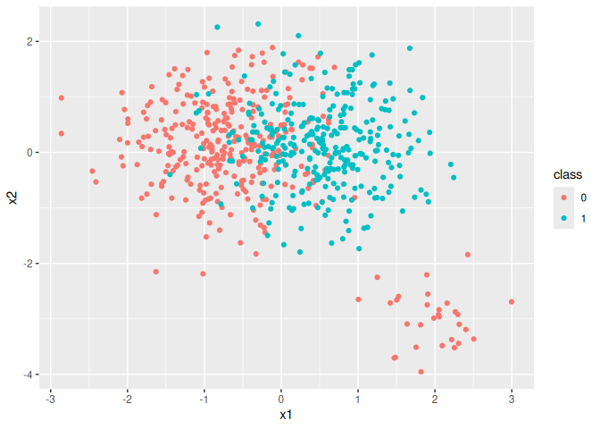

# Analysis Running Times
DSLAB

``` r
source('../GeneralAndMethodFunctions.R')

library(plyr)
library(dplyr)
library(ggplot2)
library(readr)
library(tidyr)
library(caret)
library(e1071)
library(pracma)
library(CORElearn)
library(microbenchmark)
```

# Simulated data

Generation of simulated data ans selection of best parameter for SVM.

``` r
set.seed(2812)
a1 = rnorm(300,1,0.25)
a2 = rnorm(30,2,0.15)
b1 = rnorm(300,1.5,0.25)

set.seed(12)
a12 = rnorm(300,2.5,0.25)
a22 = rnorm(30,1.5,0.15)
b12 = rnorm(300,2.5,0.25)

a=c(a1,a2)
a_2=c(a12,a22)

class_0 = data.frame("x1"=a, "x2"=a_2, "class"="0")
class_1 = data.frame("x1"=b1, "x2"=b12, "class"="1")
df = rbind(class_0, class_1)
df[,-3] = scale(df[,-3])

df %>% ggplot(aes(x = x1, y = x2, colour = class)) + geom_point()
```



``` r
set.seed(1)
df$class <- as.factor(df$class) 
svm_cv <- tune("svm", class ~ ., data = df,
               kernel = 'linear', scale=FALSE,
               ranges = list(cost = c(0.001, 0.01, 0.1, 1, 5, 10, 20, 50, 100,
                                      150, 200)))
summary(svm_cv)
```


    Parameter tuning of 'svm':

    - sampling method: 10-fold cross validation 

    - best parameters:
     cost
        1

    - best performance: 0.2380952 

    - Detailed performance results:
          cost     error dispersion
    1    0.001 0.4761905 0.03509656
    2    0.010 0.2460317 0.06661205
    3    0.100 0.2396825 0.06585123
    4    1.000 0.2380952 0.06260402
    5    5.000 0.2396825 0.06412821
    6   10.000 0.2396825 0.06412821
    7   20.000 0.2396825 0.06412821
    8   50.000 0.2396825 0.06412821
    9  100.000 0.2396825 0.06412821
    10 150.000 0.2396825 0.06412821
    11 200.000 0.2396825 0.06412821

``` r
best_cost=svm_cv$best.model$cost

set.seed(1)
df$class <- as.factor(df$class)
df_no_target <- df[, setdiff(names(df), "class")]
model_svm = svm(class ~ ., data=df, kernel="linear", scale=FALSE, probability=TRUE, type="C", cost=best_cost)
pred_svm = predict(model_svm, df_no_target, probability=TRUE, decision.values = TRUE)

probs_model_train <- attr(pred_svm,"probabilities")
probs_model_train <- probs_model_train[,c("0", "1")]
probs_model_train_class1 <- probs_model_train[,2]
```

## 3 categories

``` r
# Max GPS with restrictions. After the model
restriction = TRUE
user_condition <- function(p, p_, r, r_) {
  (p[3] > 0.8) & (p_[1] > 0.9) & (r_[1]>0.4) 
}

num_cuts = 2
vector_GPS = c('p13', 'p_11','r31' ) #'r1_1',


# In the model
user_condition_in <- function(p, p_, r, r_) {
  # Constraints list
  conditions <- list(
    list(value = p_[1], threshold = 0.9, op = ">"),  
    list(value = r_[1], threshold = 0.4, op = ">"),   
    list(value = p[3], threshold = 0.8, op = ">")    
  )
  
  # Evaluation of constraints
  results <- lapply(conditions, function(cond) {
    if (cond$op == "<") return(cond$value < cond$threshold)
    if (cond$op == ">") return(cond$value > cond$threshold)
    if (cond$op == "<=") return(cond$value <= cond$threshold)
    if (cond$op == ">=") return(cond$value >= cond$threshold)
  })
  
  all_true = all(unlist(results))
  if (all_true){
    total_cond = TRUE
  } else{
    total_cond = FALSE
  }
  
  return(list(conditions = conditions, results = results,total_cond=total_cond))
}

kernelSVM = 'linear'
num_cuts = 2
vector_GPS = c('p13', 'p_11', 'r31')
cv_folds = 3
restriction = TRUE


comp_sim_3 <- microbenchmark(AfterTheModel(df, probs_model_train,restriction,user_condition,vector_GPS,num_cuts),
               InTheModel(df,kernelSVM,num_cuts,cv_folds,vector_GPS,restriction,user_condition_in))
```

``` r
comp_sim_3
```

    Unit: milliseconds
                                                                                               expr
       AfterTheModel(df, probs_model_train, restriction, user_condition,      vector_GPS, num_cuts)
     InTheModel(df, kernelSVM, num_cuts, cv_folds, vector_GPS, restriction,      user_condition_in)
            min         lq       mean     median         uq        max neval
       33.75573   40.44952   43.40732   42.21635   47.05326   69.14708   100
     2408.21041 2793.48833 2920.01927 2932.95318 3073.29379 3495.33241   100

## 2 categories

``` r
comp_sim_2
```

    Unit: milliseconds
                                                                                               expr
       AfterTheModel(df, probs_model_train, restriction, user_condition,      vector_GPS, num_cuts)
     InTheModel(df, kernelSVM, num_cuts, cv_folds, vector_GPS, restriction,      user_condition_in)
             min          lq        mean      median          uq        max neval
        3.535899    3.843478    4.552976    4.134135    4.657813   11.00312   100
     1359.011002 1460.322907 1616.671647 1540.263436 1654.580026 2444.89486   100

# Mammographic dataset

## 4x2. After the model and in.

``` r
restriction = TRUE
user_condition <- function(p, p_, r, r_) {
  (r_[1] > 0.5) & (r_[2] > 0.1)   & (p[3]>0.7) & (p[3]<0.85) & (p[4]>0.85) & (p_[1]>0.8)
}

num_cuts = 3
vector_GPS = c('p14', 'p_11', 'r1_1') 


user_condition_in <- function(p, p_, r, r_) {
  conditions <- list(
   list(value = r_[1], threshold = 0.5, op = ">"), 
   list(value = p_[1], threshold = 0.8, op = ">"), 
   list(value = r_[2], threshold = 0.1, op = ">"),   
    list(value = p[3], threshold = 0.7, op = ">"),    
    list(value = p[3], threshold = 0.85, op = "<"),   
   list(value = p[4], threshold = 0.85, op = ">")   
  )
  
  results <- lapply(conditions, function(cond) {
    if (cond$op == "<") return(cond$value < cond$threshold)
    if (cond$op == ">") return(cond$value > cond$threshold)
    if (cond$op == "<=") return(cond$value <= cond$threshold)
    if (cond$op == ">=") return(cond$value >= cond$threshold)
  })
  
  all_true = all(unlist(results))
  if (all_true){
    total_cond = TRUE
  } else{
    total_cond = FALSE
  }
  
  return(list(conditions = conditions, results = results,total_cond=total_cond))
}

kernelSVM = 'radial'
cv_folds = 3


mammo_times <- microbenchmark(AfterTheModel(dfTrain, probs_model_train,restriction,user_condition,vector_GPS,num_cuts), InTheModel(dfTrain,kernelSVM,num_cuts,cv_folds,vector_GPS,restriction,user_condition_in))
```

``` r
mammo_times
```

    Unit: milliseconds
                                                                                                    expr
       AfterTheModel(dfTrain, probs_model_train, restriction, user_condition,      vector_GPS, num_cuts)
     InTheModel(dfTrain, kernelSVM, num_cuts, cv_folds, vector_GPS,      restriction, user_condition_in)
           min        lq      mean    median       uq        max neval
      222.9252  230.7455  252.3732  236.5401  254.403   413.1931   100
     8699.4552 8907.0265 9566.6228 9525.2044 9874.733 11910.3074   100

# Pima

## Case 5x2. After and In.

``` r
restriction = TRUE
user_condition <- function(p, p_, r, r_) {
  (r_[1]>0.3) & (p[4]>0.7) & (p[3]>0.4) & (p[5]>0.9)
}

num_cuts = 4
vector_GPS = c('p15', 'p_11') 


user_condition_in <- function(p, p_, r, r_) {
  conditions <- list(
   list(value = r_[1], threshold = 0.3, op = ">"),
   list(value = p[4], threshold = 0.7, op = ">"),
   list(value = p[5], threshold = 0.9, op = ">"),
   list(value = p[3], threshold = 0.4, op = ">")
  )
  
  results <- lapply(conditions, function(cond) {
    if (cond$op == "<") return(cond$value < cond$threshold)
    if (cond$op == ">") return(cond$value > cond$threshold)
    if (cond$op == "<=") return(cond$value <= cond$threshold)
    if (cond$op == ">=") return(cond$value >= cond$threshold)
  })
  
  all_true = all(unlist(results))
  if (all_true){
    total_cond = TRUE
  } else{
    total_cond = FALSE
  }
  
  return(list(conditions = conditions, results = results,total_cond=total_cond))
}

kernelSVM = 'radial'
cv_folds = 2

pima_times <- microbenchmark(AfterTheModel(dfTrain, probs_model_train,restriction,user_condition,vector_GPS,num_cuts),
                             InTheModel(dfTrain,kernelSVM,num_cuts,cv_folds,vector_GPS,restriction,user_condition_in))
```

``` r
pima_times
```

    Unit: milliseconds
                                                                                                    expr
       AfterTheModel(dfTrain, probs_model_train, restriction, user_condition,      vector_GPS, num_cuts)
     InTheModel(dfTrain, kernelSVM, num_cuts, cv_folds, vector_GPS,      restriction, user_condition_in)
           min        lq      mean    median       uq       max neval
       983.747  1018.972  1066.289  1040.569  1095.25  1324.544   100
     22706.538 23539.934 24307.297 23948.588 24736.33 28252.397   100
