# Analysis Variance Across Splits
DSLAB

To assess the effect of random train-test splits on the variability of
the results, we repeated the train-test partitioning 10 times for each
real dataset. In the tables, predicted categories are represented
numerically (0, 1, 2, …), corresponding to their respective labels
(e.g., ‘low’, ‘medium’, ‘high’). For each category, we report a summary
of the predictions across the 10 repetitions, including the mean,
standard deviation, median, and 95% confidence interval.

``` r
library(plyr)
library(dplyr)
library(ggplot2)
library(readr)
library(tidyr)
library(caret)
library(e1071)
library(pracma)
library(CORElearn)
source('../GeneralAndMethodFunctions.R')
source('../VarianceAcrossSplits.R')
```

# Mammographic

``` r
df <- read_csv("../datasets/mammographic_masses.data", col_names = FALSE)

colnames(df) <- c("BI-RADS", "Age", "Shape", "Margin", "Density", "class")
df=df %>% mutate_if(is.character, as.numeric)

df = drop_na(df)
df$class <- as.factor(df$class)
str(df)
```

    tibble [830 × 6] (S3: tbl_df/tbl/data.frame)
     $ BI-RADS: num [1:830] 5 5 4 5 5 3 4 4 4 3 ...
     $ Age    : num [1:830] 67 58 28 57 76 42 36 60 54 52 ...
     $ Shape  : num [1:830] 3 4 1 1 1 2 3 2 1 3 ...
     $ Margin : num [1:830] 5 5 1 5 4 1 1 1 1 4 ...
     $ Density: num [1:830] 3 3 3 3 3 3 2 2 3 3 ...
     $ class  : Factor w/ 2 levels "0","1": 2 2 1 2 2 2 1 1 1 1 ...

``` r
df[,-6] <- scale(df[,-6])
```

## Classic cut: 1/2. Fixed threshold

Train:

``` r
all_results$E1_summary$E_train_summary
```

    # A tibble: 2 × 6
      key    mean      sd median CI_inf CI_sup
      <fct> <dbl>   <dbl>  <dbl>  <dbl>  <dbl>
    1 0     0.149 0.00173  0.148  0.145  0.153
    2 1     0.868 0.0107   0.871  0.844  0.892

``` r
CM <-  all_results$E1_summary$CM_mean_train

list_names_obs <- c('Benign','Malignant')
list_names_pred <- c('Low','High')
mean_CI <- all_results$E1_summary$E_train_summary
mean_CI$key <- list_names_pred
labels_top <- make_labels_top(mean_CI, 1)[list_names_pred]

E1_plot <- barplot_CM_CI(CM, list_names_obs, list_names_pred, labels_top, label_size =5)
```

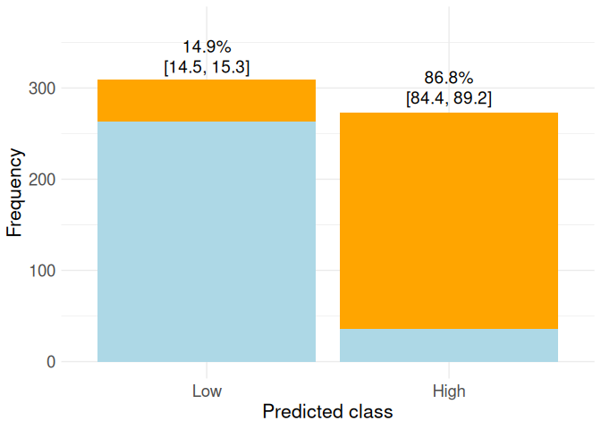

Test:

``` r
all_results$E1_summary$E_test_summary
```

    # A tibble: 2 × 6
      key    mean     sd median CI_inf CI_sup
      <fct> <dbl>  <dbl>  <dbl>  <dbl>  <dbl>
    1 0     0.189 0.0215  0.196  0.140  0.237
    2 1     0.850 0.0159  0.845  0.815  0.886

``` r
CM <-  all_results$E1_summary$CM_mean_test
list_names_obs <- c('Benign','Malignant')
list_names_pred <- c('Low','High')
mean_CI <- all_results$E1_summary$E_test_summary
mean_CI$key <- list_names_pred
labels_top <- make_labels_top(mean_CI, 1)[list_names_pred]

E1_test_plot <- barplot_CM_CI(CM, list_names_obs, list_names_pred, labels_top, label_size =5)
```

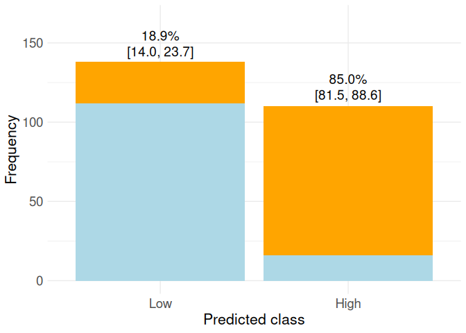

## 3 classic cuts: 1/4-2/4-3/4

Train:

``` r
all_results$E2_summary$E_train_summary
```

    # A tibble: 4 × 6
      key    mean      sd median CI_inf CI_sup
      <fct> <dbl>   <dbl>  <dbl>  <dbl>  <dbl>
    1 0     0.107 0.00113  0.106  0.104  0.109
    2 1     0.454 0.0159   0.459  0.418  0.490
    3 2     0.659 0.0257   0.667  0.600  0.717
    4 3     0.890 0.00347  0.891  0.882  0.898

``` r
list_names_obs <- c('Benign','Malignant')
list_names_pred <- c('Low','Medium','High','Very high')

CM <-  all_results$E2_summary$CM_mean_train

mean_CI <- all_results$E2_summary$E_train_summary
mean_CI$key <- list_names_pred
labels_top <- make_labels_top(mean_CI, 1)[list_names_pred]

E2_plot <- barplot_CM_CI(CM, list_names_obs, list_names_pred, labels_top, label_size =4)
```

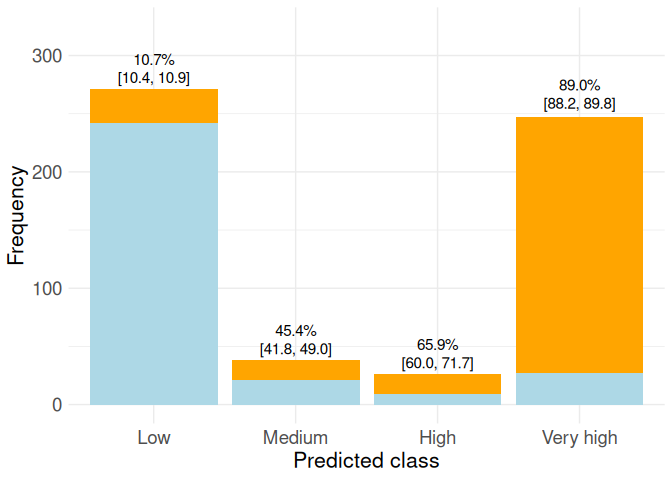

Test:

``` r
all_results$E2_summary$E_test_summary
```

    # A tibble: 4 × 6
      key    mean      sd median CI_inf CI_sup
      <fct> <dbl>   <dbl>  <dbl>  <dbl>  <dbl>
    1 0     0.133 0.0191   0.139 0.0901  0.177
    2 1     0.605 0.0645   0.625 0.459   0.751
    3 2     0.514 0.0452   0.5   0.412   0.616
    4 3     0.907 0.00836  0.904 0.888   0.926

``` r
list_names_obs <- c('Benign','Malignant')
list_names_pred <- c('Low','Medium','High','Very high')

CM <-  all_results$E2_summary$CM_mean_test

mean_CI <- all_results$E2_summary$E_test_summary
mean_CI$key <- list_names_pred
labels_top <- make_labels_top(mean_CI, 1)[list_names_pred]

E2_test_plot <- barplot_CM_CI(CM, list_names_obs, list_names_pred, labels_top, label_size =4)
```

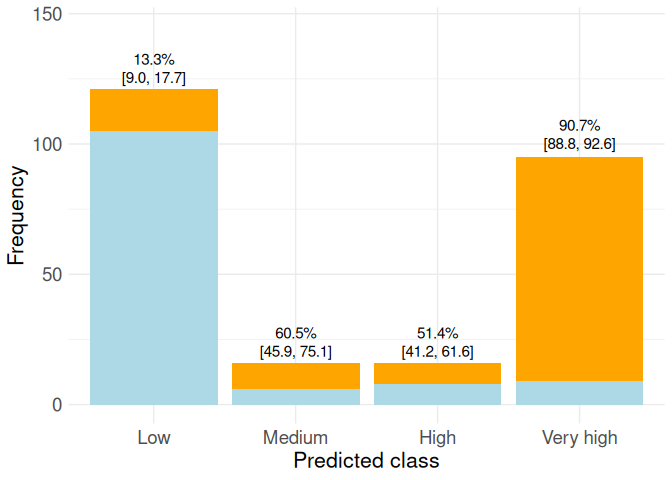

## Max GPS(p14, p_11, r1_1) without constraints

Train:

``` r
all_results$E3_summary$E_train_summary
```

    # A tibble: 4 × 6
      key    mean      sd median CI_inf CI_sup
      <fct> <dbl>   <dbl>  <dbl>  <dbl>  <dbl>
    1 0     0.156 0.00898  0.153  0.135  0.176
    2 1     0.612 0.00408  0.613  0.602  0.621
    3 2     0.881 0.0875   0.908  0.683  1.08 
    4 3     0.990 0.0312   1      0.920  1.06 

``` r
list_names_obs <- c('Low','High')
list_names_pred <- c('Low','Medium','High','Very high')

CM <-  all_results$E3_summary$CM_mean_train

mean_CI <- all_results$E3_summary$E_train_summary
mean_CI$key <- list_names_pred
labels_top <- make_labels_top(mean_CI, 1)[list_names_pred]

E3_plot <- barplot_CM_CI(CM, list_names_obs, list_names_pred, labels_top, label_size =4)
```

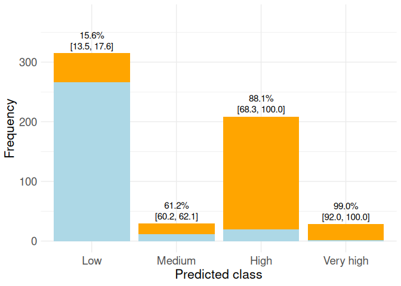

Test:

``` r
all_results$E3_summary$E_test_summary
```

    # A tibble: 4 × 6
      key    mean     sd median CI_inf CI_sup
      <fct> <dbl>  <dbl>  <dbl>  <dbl>  <dbl>
    1 0     0.202 0.0177  0.207  0.161  0.242
    2 1     0.553 0.0252  0.545  0.497  0.610
    3 2     0.903 0.0243  0.910  0.848  0.958
    4 3     0.994 0.0178  1      0.954  1.03 

``` r
list_names_obs <- c('Low','High')
list_names_pred <- c('Low','Medium','High','Very high')

CM <-  all_results$E3_summary$CM_mean_test

mean_CI <- all_results$E3_summary$E_test_summary
mean_CI$key <- list_names_pred
labels_top <- make_labels_top(mean_CI, 1)[list_names_pred]

E3_test_plot <- barplot_CM_CI(CM, list_names_obs, list_names_pred, labels_top, label_size =4)
```

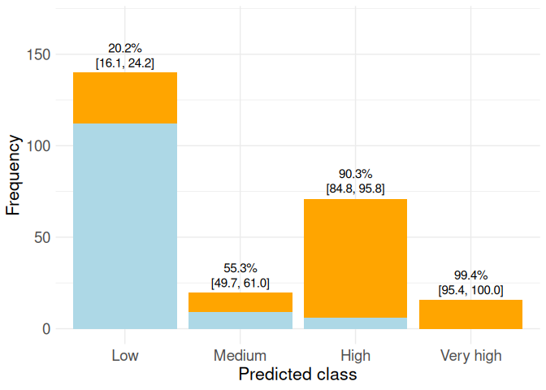

## Calibration: isotonic

Train:

``` r
all_results$E4_summary$E_train_summary
```

    # A tibble: 4 × 6
      key     mean       sd median CI_inf CI_sup
      <fct>  <dbl>    <dbl>  <dbl>  <dbl>  <dbl>
    1 0     0.0702 0.000216 0.0702 0.0697 0.0707
    2 1     0.419  0.00407  0.418  0.410  0.428 
    3 2     0.613  0.00833  0.615  0.594  0.632 
    4 3     0.931  0.00514  0.932  0.919  0.942 

``` r
list_names_obs <- c('Low','High')
list_names_pred <- c('Low','Medium','High','Very high')

CM <-  all_results$E4_summary$CM_mean_train

mean_CI <- all_results$E4_summary$E_train_summary
mean_CI$key <- list_names_pred
labels_top <- make_labels_top(mean_CI, 1)[list_names_pred]

E4_plot <- barplot_CM_CI(CM, list_names_obs, list_names_pred, labels_top, label_size =4)
```

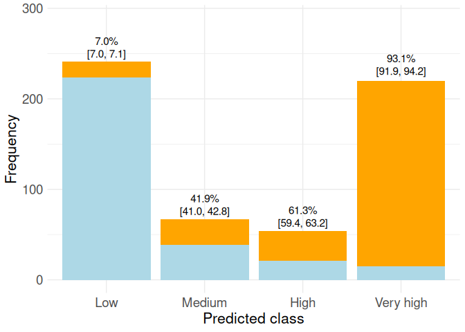

Test:

``` r
all_results$E4_summary$E_test_summary
```

    # A tibble: 4 × 6
      key     mean      sd median CI_inf CI_sup
      <fct>  <dbl>   <dbl>  <dbl>  <dbl>  <dbl>
    1 0     0.0822 0.00915 0.0851 0.0615  0.103
    2 1     0.416  0.0503  0.432  0.302   0.530
    3 2     0.654  0.0339  0.643  0.577   0.730
    4 3     0.917  0.00882 0.915  0.897   0.937

``` r
list_names_obs <- c('Low','High')
list_names_pred <- c('Low','Medium','High','Very high')

CM <-  all_results$E4_summary$CM_mean_test

mean_CI <- all_results$E4_summary$E_test_summary
mean_CI$key <- list_names_pred
labels_top <- make_labels_top(mean_CI, 1)[list_names_pred]

E4_test_plot <- barplot_CM_CI(CM, list_names_obs, list_names_pred, labels_top, label_size =4)
```

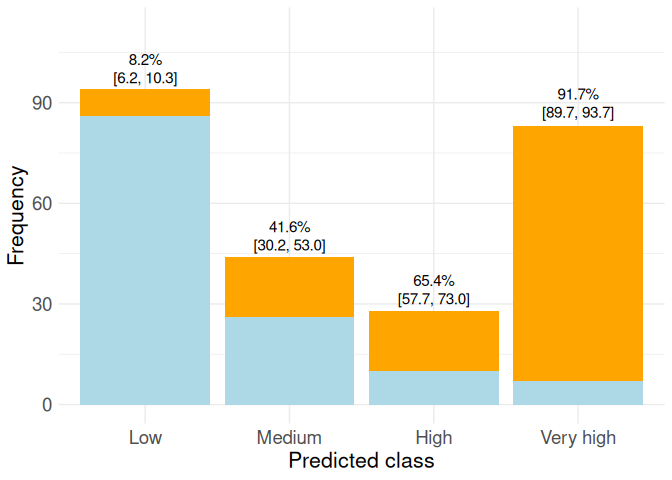

## Max GPS with restrictions: case 4x2

Train:

``` r
all_results$E5_summary$E_train_summary
```

    # A tibble: 4 × 6
      key     mean      sd median CI_inf CI_sup
      <fct>  <dbl>   <dbl>  <dbl>  <dbl>  <dbl>
    1 0     0.0906 0.00675 0.0885 0.0753  0.106
    2 1     0.489  0.00948 0.492  0.467   0.510
    3 2     0.831  0.00626 0.829  0.817   0.845
    4 3     0.954  0.0188  0.960  0.911   0.996

``` r
list_names_obs <- c('Low','High')
list_names_pred <- c('Low','Medium','High','Very high')

CM <-  all_results$E5_summary$CM_mean_train

mean_CI <- all_results$E5_summary$E_train_summary
mean_CI$key <- list_names_pred
labels_top <- make_labels_top(mean_CI, 1)[list_names_pred]

E5_plot <- barplot_CM_CI(CM, list_names_obs, list_names_pred, labels_top, label_size =4)
```

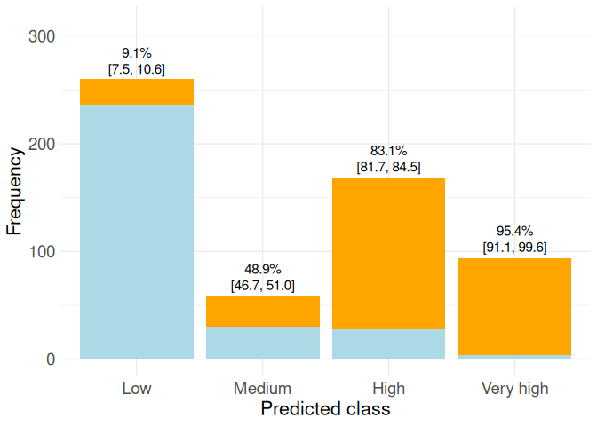

Test:

``` r
all_results$E5_summary$E_test_summary
```

    # A tibble: 4 × 6
      key    mean      sd median CI_inf CI_sup
      <fct> <dbl>   <dbl>  <dbl>  <dbl>  <dbl>
    1 0     0.109 0.0105   0.112 0.0851  0.132
    2 1     0.638 0.0554   0.655 0.512   0.763
    3 2     0.791 0.0324   0.781 0.718   0.865
    4 3     0.977 0.00811  0.974 0.959   0.995

``` r
list_names_obs <- c('Low','High')
list_names_pred <- c('Low','Medium','High','Very high')

CM <-  all_results$E5_summary$CM_mean_test

mean_CI <- all_results$E5_summary$E_test_summary
mean_CI$key <- list_names_pred
labels_top <- make_labels_top(mean_CI, 1)[list_names_pred]

E5_test_plot <- barplot_CM_CI(CM, list_names_obs, list_names_pred, labels_top, label_size =4)
```

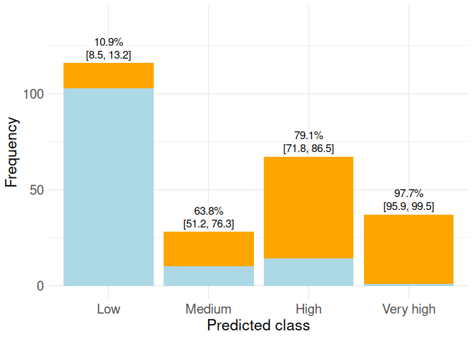

## In the model Case 4x2

Train:

``` r
all_results$E6_summary$E_train_summary
```

    # A tibble: 4 × 6
      key    mean      sd median CI_inf CI_sup
      <fct> <dbl>   <dbl>  <dbl>  <dbl>  <dbl>
    1 0     0.121 0.00742  0.123  0.104  0.138
    2 1     0.434 0.0556   0.417  0.308  0.560
    3 2     0.784 0.0212   0.791  0.736  0.832
    4 3     0.956 0.00347  0.955  0.948  0.963

``` r
list_names_obs <- c('Low','High')
list_names_pred <- c('Low','Medium','High','Very high')

CM <-  all_results$E6_summary$CM_mean_train

mean_CI <- all_results$E6_summary$E_train_summary
mean_CI$key <- list_names_pred
labels_top <- make_labels_top(mean_CI, 1)[list_names_pred]

E6_plot <- barplot_CM_CI(CM, list_names_obs, list_names_pred, labels_top, label_size =4)
```

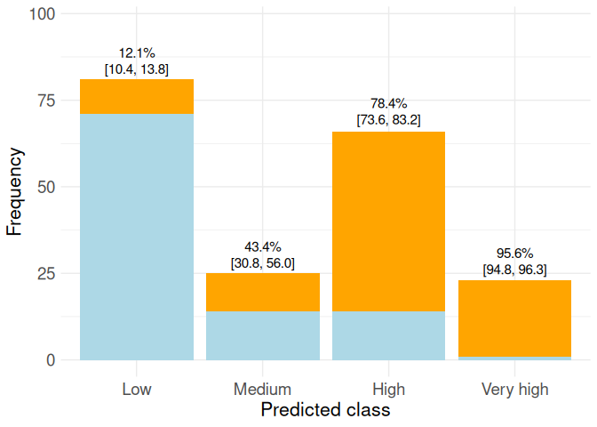

Test:

``` r
all_results$E6_summary$E_test_summary
```

    # A tibble: 4 × 6
      key     mean      sd median CI_inf CI_sup
      <fct>  <dbl>   <dbl>  <dbl>  <dbl>  <dbl>
    1 0     0.0973 0.00288 0.0982 0.0908  0.104
    2 1     0.648  0.0299  0.657  0.580   0.715
    3 2     0.801  0.00633 0.803  0.786   0.815
    4 3     1      0       1      1       1    

``` r
list_names_obs <- c('Low','High')
list_names_pred <- c('Low','Medium','High','Very high')

CM <-  all_results$E6_summary$CM_mean_test

mean_CI <- all_results$E6_summary$E_test_summary
mean_CI$key <- list_names_pred
labels_top <- make_labels_top(mean_CI, 1)[list_names_pred]

E6_test_plot <- barplot_CM_CI(CM, list_names_obs, list_names_pred, labels_top, label_size =4)
```

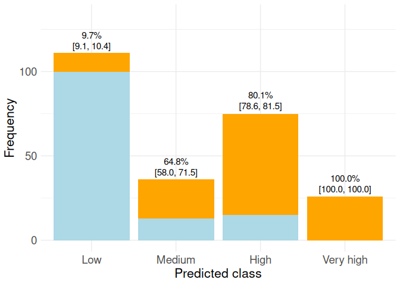

# Pima

En Pima solo mostramos TEST en el paper, no mostramos los resultados de
train.

``` r
df <- read.csv("../datasets/pima.csv")

df$class = ifelse(df$class=="tested_negative", 0, 1)
df=df %>% mutate_if(is.character, as.factor)
str(df)
```

    'data.frame':   768 obs. of  9 variables:
     $ preg : int  6 1 8 1 0 5 3 10 2 8 ...
     $ plas : int  148 85 183 89 137 116 78 115 197 125 ...
     $ pres : int  72 66 64 66 40 74 50 0 70 96 ...
     $ skin : int  35 29 0 23 35 0 32 0 45 0 ...
     $ insu : int  0 0 0 94 168 0 88 0 543 0 ...
     $ mass : num  33.6 26.6 23.3 28.1 43.1 25.6 31 35.3 30.5 0 ...
     $ pedi : num  0.627 0.351 0.672 0.167 2.288 ...
     $ age  : int  50 31 32 21 33 30 26 29 53 54 ...
     $ class: num  1 0 1 0 1 0 1 0 1 1 ...

``` r
df$class <- as.factor(df$class)
df[,-9] <- scale(df[,-9])
```

## Classic cut: 1/2. Fixed thresholds

Train:

``` r
all_results$E1_summary$E_train_summary
```

    # A tibble: 2 × 6
      key    mean      sd median CI_inf CI_sup
      <fct> <dbl>   <dbl>  <dbl>  <dbl>  <dbl>
    1 0     0.159 0.00369  0.160  0.151  0.167
    2 1     0.833 0.00460  0.834  0.823  0.843

``` r
list_names_obs <- c('Low','High')
list_names_pred <- c('Low','High')

CM <-  all_results$E1_summary$CM_mean_train

mean_CI <- all_results$E1_summary$E_train_summary
mean_CI$key <- list_names_pred
labels_top <- make_labels_top(mean_CI, 1)[list_names_pred]

E1_plot_pima <- barplot_CM_CI(CM, list_names_obs, list_names_pred, labels_top, label_size =5)
```

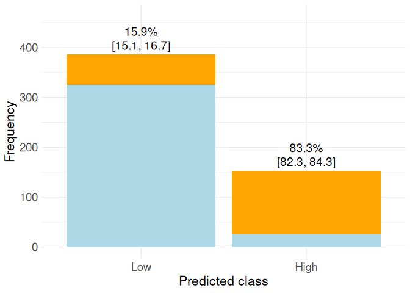

Test:

``` r
all_results$E1_summary$E_test_summary
```

    # A tibble: 2 × 6
      key    mean     sd median CI_inf CI_sup
      <fct> <dbl>  <dbl>  <dbl>  <dbl>  <dbl>
    1 0     0.194 0.0134  0.190  0.164  0.224
    2 1     0.691 0.0105  0.694  0.667  0.715

``` r
list_names_obs <- c('Low','High')
list_names_pred <- c('Low','High')

CM <-  all_results$E1_summary$CM_mean_test

mean_CI <- all_results$E1_summary$E_test_summary
mean_CI$key <- list_names_pred
labels_top <- make_labels_top(mean_CI, 1)[list_names_pred]

E1_test_plot_pima <- barplot_CM_CI(CM, list_names_obs, list_names_pred, labels_top, label_size =5)
```

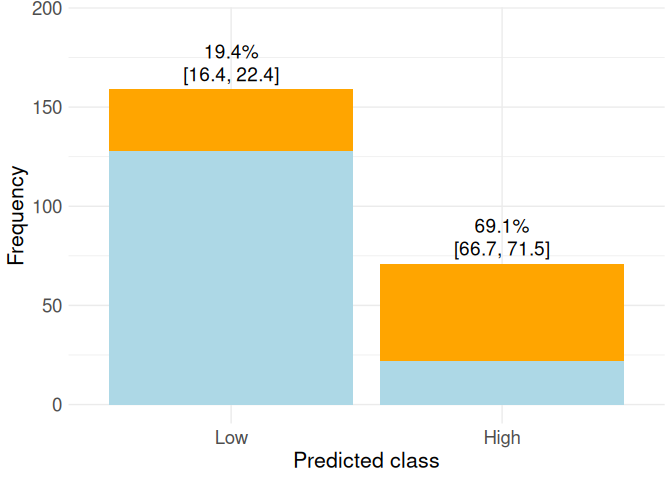

## 4 cuts: 1/5-2/5-3/5-4/5

Train:

``` r
all_results$E2_summary$E_train_summary
```

    # A tibble: 5 × 6
      key     mean       sd median CI_inf CI_sup
      <fct>  <dbl>    <dbl>  <dbl>  <dbl>  <dbl>
    1 0     0.0521 0.000263  0.052 0.0515 0.0527
    2 1     0.355  0.000374  0.355 0.354  0.356 
    3 2     0.479  0.0180    0.474 0.439  0.520 
    4 3     0.820  0.0203    0.826 0.774  0.866 
    5 4     0.924  0.00296   0.923 0.917  0.931 

``` r
list_names_obs <- c('Low','High')
list_names_pred <- c('Very low','Low','Medium','High','Very high')

CM <-  all_results$E2_summary$CM_mean_train

mean_CI <- all_results$E2_summary$E_train_summary
mean_CI$key <- list_names_pred
labels_top <- make_labels_top(mean_CI, 1)[list_names_pred]

E2_plot_pima <- barplot_CM_CI(CM, list_names_obs, list_names_pred, labels_top, label_size =3.9)
```

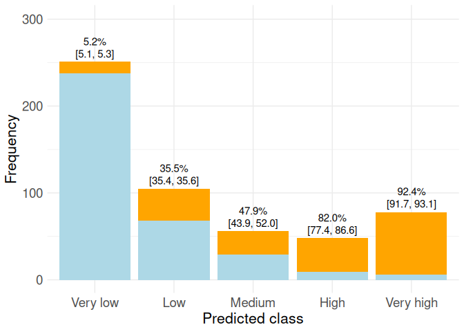

Test:

``` r
all_results$E2_summary$E_test_summary
```

    # A tibble: 5 × 6
      key    mean     sd median CI_inf CI_sup
      <fct> <dbl>  <dbl>  <dbl>  <dbl>  <dbl>
    1 0     0.119 0.0113  0.116 0.0938  0.145
    2 1     0.296 0.0152  0.292 0.262   0.331
    3 2     0.405 0.0381  0.417 0.319   0.491
    4 3     0.726 0.0247  0.733 0.670   0.781
    5 4     0.862 0.0164  0.857 0.825   0.899

``` r
list_names_obs <- c('Low','High')
list_names_pred <- c('Very low','Low','Medium','High','Very high')

CM <-  all_results$E2_summary$CM_mean_test

mean_CI <- all_results$E2_summary$E_test_summary
mean_CI$key <- list_names_pred
labels_top <- make_labels_top(mean_CI, 1)[list_names_pred]

E2_test_plot_pima <- barplot_CM_CI(CM, list_names_obs, list_names_pred, labels_top, label_size =3.9)
```

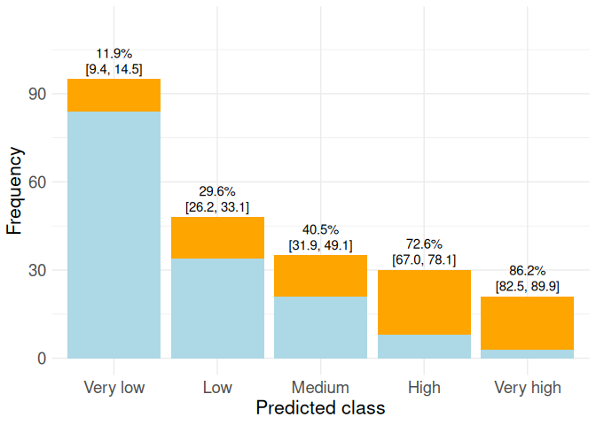

## isotonic 5x2

Train:

``` r
all_results$E3_summary$E_train_summary
```

    # A tibble: 5 × 6
      key     mean      sd median CI_inf CI_sup
      <fct>  <dbl>   <dbl>  <dbl>  <dbl>  <dbl>
    1 0     0.0631 0.00375 0.0643 0.0546 0.0716
    2 1     0.361  0.0235  0.368  0.308  0.414 
    3 2     0.444  0.00784 0.442  0.427  0.462 
    4 3     0.736  0.0146  0.741  0.703  0.769 
    5 4     0.915  0.00241 0.916  0.910  0.921 

``` r
list_names_obs <- c('Low','High')
list_names_pred <- c('Very low','Low','Medium','High','Very high')

CM <-  all_results$E3_summary$CM_mean_train

mean_CI <- all_results$E3_summary$E_train_summary
mean_CI$key <- list_names_pred
labels_top <- make_labels_top(mean_CI, 1)[list_names_pred]

E3_plot_pima <- barplot_CM_CI(CM, list_names_obs, list_names_pred, labels_top, label_size =3.9)
```

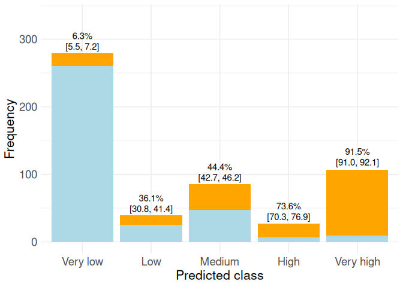

Test:

``` r
all_results$E3_summary$E_test_summary
```

    # A tibble: 5 × 6
      key    mean      sd median CI_inf CI_sup
      <fct> <dbl>   <dbl>  <dbl>  <dbl>  <dbl>
    1 0     0.126 0.0103   0.123  0.103  0.149
    2 1     0.253 0.00818  0.25   0.234  0.271
    3 2     0.426 0.0272   0.435  0.365  0.488
    4 3     0.632 0        0.632  0.632  0.632
    5 4     0.796 0.00338  0.795  0.788  0.804

``` r
list_names_obs <- c('Low','High')
list_names_pred <- c('Very low','Low','Medium','High','Very high')

CM <-  all_results$E3_summary$CM_mean_test

mean_CI <- all_results$E3_summary$E_test_summary
mean_CI$key <- list_names_pred
labels_top <- make_labels_top(mean_CI, 1)[list_names_pred]

E3_test_plot_pima <- barplot_CM_CI(CM, list_names_obs, list_names_pred, labels_top, label_size =3.9)
```

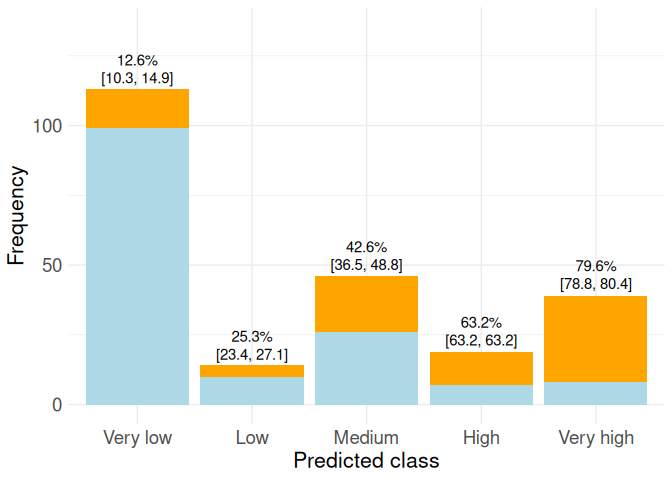

## Max GPS(p_11,p15) without constraints

Train:

``` r
all_results$E4_summary$E_train_summary
```

    # A tibble: 5 × 6
      key     mean      sd median  CI_inf CI_sup
      <fct>  <dbl>   <dbl>  <dbl>   <dbl>  <dbl>
    1 0     0.0110 0.00386 0.0122 0.00225 0.0197
    2 1     0.128  0.0136  0.132  0.0971  0.159 
    3 2     0.414  0.0153  0.409  0.379   0.449 
    4 3     0.785  0.0354  0.796  0.705   0.865 
    5 4     0.993  0.0214  1      0.945   1.04  

``` r
list_names_obs <- c('Low','High')
list_names_pred <- c('Very low','Low','Medium','High','Very high')

CM <-  all_results$E4_summary$CM_mean_train

mean_CI <- all_results$E4_summary$E_train_summary
mean_CI$key <- list_names_pred
labels_top <- make_labels_top(mean_CI, 1)[list_names_pred]

E4_plot_pima <- barplot_CM_CI(CM, list_names_obs, list_names_pred, labels_top, label_size =3.9)
```

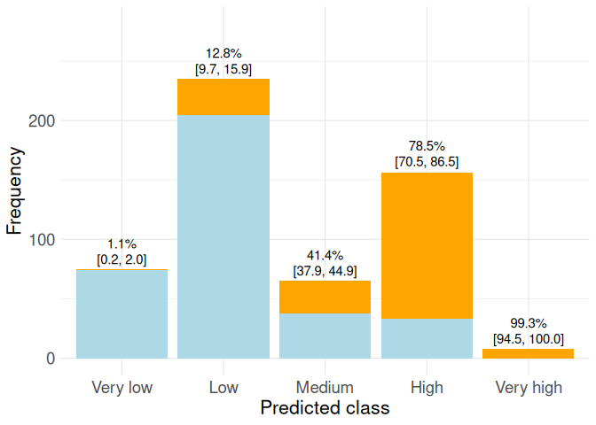

Test:

``` r
all_results$E4_summary$E_test_summary
```

    # A tibble: 5 × 6
      key    mean      sd median  CI_inf CI_sup
      <fct> <dbl>   <dbl>  <dbl>   <dbl>  <dbl>
    1 0     0.045 0.0158   0.05  0.00923 0.0808
    2 1     0.182 0.00263  0.183 0.176   0.188 
    3 2     0.382 0.0220   0.375 0.332   0.432 
    4 3     0.649 0.0562   0.667 0.522   0.776 
    5 4     0.991 0.0287   1     0.926   1.06  

``` r
list_names_obs <- c('Low','High')
list_names_pred <- c('Very low','Low','Medium','High','Very high')

CM <-  all_results$E4_summary$CM_mean_test

mean_CI <- all_results$E4_summary$E_test_summary
mean_CI$key <- list_names_pred
labels_top <- make_labels_top(mean_CI, 1)[list_names_pred]

E4_test_plot_pima <- barplot_CM_CI(CM, list_names_obs, list_names_pred, labels_top, label_size =3.9)
```

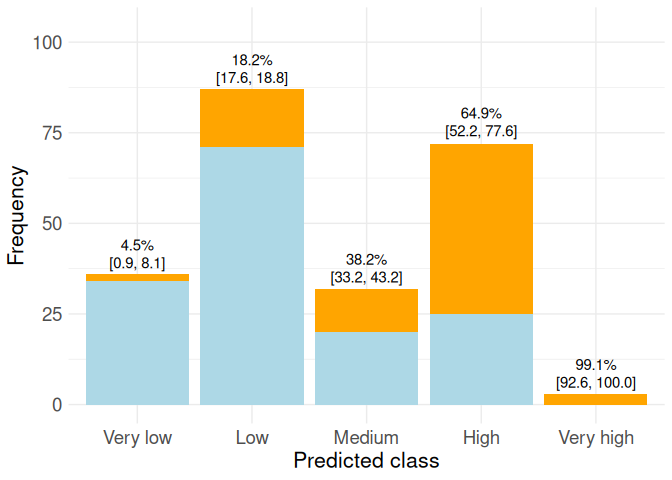

## Max GPS with restrictions: case 5x2. After the model

Train:

``` r
all_results$E5_summary$E_train_summary
```

    # A tibble: 5 × 6
      key     mean      sd median CI_inf CI_sup
      <fct>  <dbl>   <dbl>  <dbl>  <dbl>  <dbl>
    1 0     0.0460 0.0106  0.0494 0.0221 0.0700
    2 1     0.154  0.00651 0.156  0.140  0.169 
    3 2     0.411  0.00751 0.409  0.394  0.428 
    4 3     0.789  0.0228  0.796  0.737  0.841 
    5 4     0.993  0.0214  1      0.945  1.04  

``` r
list_names_obs <- c('Low','High')
list_names_pred <- c('Very low','Low','Medium','High','Very high')

CM <-  all_results$E5_summary$CM_mean_train

mean_CI <- all_results$E5_summary$E_train_summary
mean_CI$key <- list_names_pred
labels_top <- make_labels_top(mean_CI, 1)[list_names_pred]

E5_plot_pima <- barplot_CM_CI(CM, list_names_obs, list_names_pred, labels_top, label_size =3.9)
```

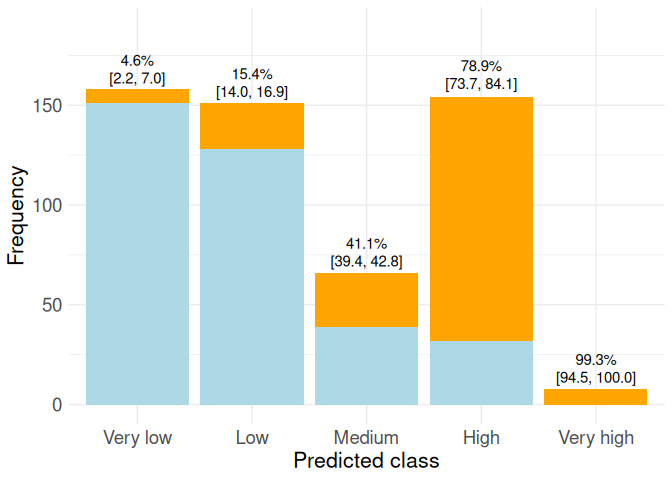

Test:

``` r
all_results$E5_summary$E_test_summary
```

    # A tibble: 5 × 6
      key     mean      sd median CI_inf CI_sup
      <fct>  <dbl>   <dbl>  <dbl>  <dbl>  <dbl>
    1 0     0.0696 0.00251 0.0704 0.0640 0.0753
    2 1     0.236  0.00165 0.235  0.232  0.240 
    3 2     0.379  0.0125  0.375  0.351  0.407 
    4 3     0.652  0.0448  0.667  0.551  0.754 
    5 4     0.991  0.0287  1      0.926  1.06  

``` r
list_names_obs <- c('Low','High')
list_names_pred <- c('Very low','Low','Medium','High','Very high')

CM <-  all_results$E5_summary$CM_mean_test

mean_CI <- all_results$E5_summary$E_test_summary
mean_CI$key <- list_names_pred
labels_top <- make_labels_top(mean_CI, 1)[list_names_pred]

E5_test_plot_pima <- barplot_CM_CI(CM, list_names_obs, list_names_pred, labels_top, label_size =3.9)
```

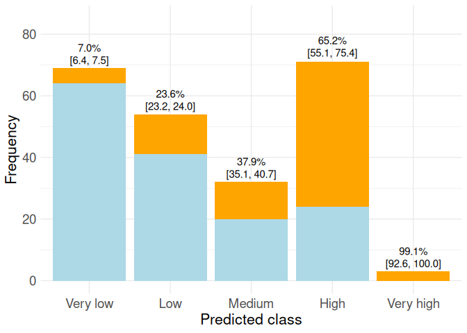

## In the model Case 5x2

Train:

``` r
all_results$E6_summary$E_train_summary
```

    # A tibble: 5 × 6
      key     mean      sd median CI_inf CI_sup
      <fct>  <dbl>   <dbl>  <dbl>  <dbl>  <dbl>
    1 0     0.0371 0.00205 0.0377 0.0324 0.0417
    2 1     0.111  0.0196  0.118  0.0670 0.156 
    3 2     0.447  0.00169 0.447  0.443  0.450 
    4 3     0.975  0.0791  1      0.796  1.15  
    5 4     1      0       1      1      1     

``` r
list_names_obs <- c('Low','High')
list_names_pred <- c('Very low','Low','Medium','High','Very high')

CM <-  all_results$E6_summary$CM_mean_train

mean_CI <- all_results$E6_summary$E_train_summary
mean_CI$key <- list_names_pred
labels_top <- make_labels_top(mean_CI, 1)[list_names_pred]

E6_plot_pima <- barplot_CM_CI(CM, list_names_obs, list_names_pred, labels_top, label_size =3.9)
```

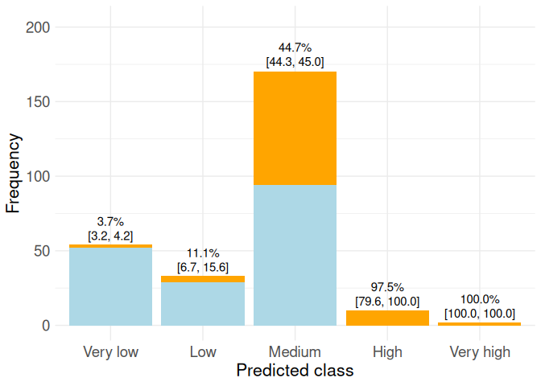

Test:

``` r
all_results$E6_summary$E_test_summary
```

    # A tibble: 5 × 6
      key     mean      sd median  CI_inf CI_sup
      <fct>  <dbl>   <dbl>  <dbl>   <dbl>  <dbl>
    1 0     0.0427 0.00843 0.04    0.0236 0.0617
    2 1     0.0493 0.0389  0.0370 -0.0386 0.137 
    3 2     0.463  0.0261  0.471   0.404  0.522 
    4 3     0.797  0.0345  0.786   0.719  0.875 
    5 4     1      0       1       1      1     

``` r
list_names_obs <- c('Low','High')
list_names_pred <- c('Very low','Low','Medium','High','Very high')

CM <-  all_results$E6_summary$CM_mean_test

mean_CI <- all_results$E6_summary$E_test_summary
mean_CI$key <- list_names_pred
labels_top <- make_labels_top(mean_CI, 1)[list_names_pred]

E6_test_plot_pima <- barplot_CM_CI(CM, list_names_obs, list_names_pred, labels_top, label_size =3.9)
```

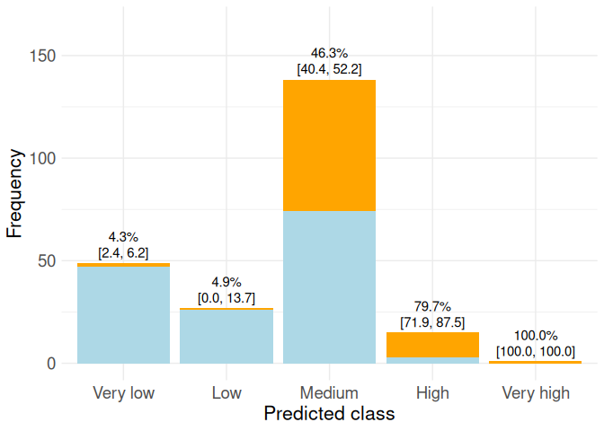
