# Results of Simulated data
DSLAB

``` r
source('../GeneralAndMethodFunctions.R')

library(plyr)
library(dplyr)
library(ggplot2)
library(readr)
library(tidyr)
library(caret)
library(e1071)
library(pracma)
library(CORElearn)
```

Generation of simulated data ans selection of best parameter for SVM.

``` r
set.seed(2812)
a1 = rnorm(300,1,0.25)
a2 = rnorm(30,2,0.15)
b1 = rnorm(300,1.5,0.25)

set.seed(12)
a12 = rnorm(300,2.5,0.25)
a22 = rnorm(30,1.5,0.15)
b12 = rnorm(300,2.5,0.25)

a=c(a1,a2)
a_2=c(a12,a22)

class_0 = data.frame("x1"=a, "x2"=a_2, "class"="0")
class_1 = data.frame("x1"=b1, "x2"=b12, "class"="1")
df = rbind(class_0, class_1)
df[,-3] = scale(df[,-3])

df %>% ggplot(aes(x = x1, y = x2, colour = class)) + geom_point()
```

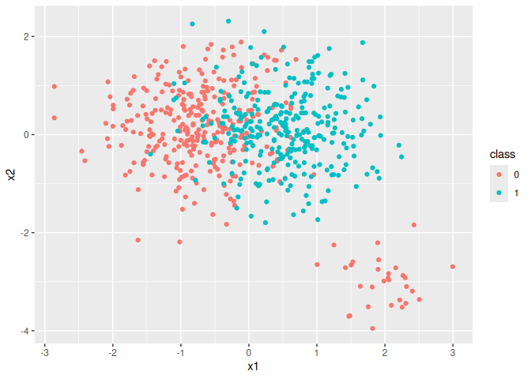

``` r
set.seed(1)
df$class <- as.factor(df$class) 
svm_cv <- tune("svm", class ~ ., data = df,
               kernel = 'linear', scale=FALSE,
               ranges = list(cost = c(0.001, 0.01, 0.1, 1, 5, 10, 20, 50, 100,
                                      150, 200)))
summary(svm_cv)
```


    Parameter tuning of 'svm':

    - sampling method: 10-fold cross validation 

    - best parameters:
     cost
        1

    - best performance: 0.2380952 

    - Detailed performance results:
          cost     error dispersion
    1    0.001 0.4761905 0.03509656
    2    0.010 0.2460317 0.06661205
    3    0.100 0.2396825 0.06585123
    4    1.000 0.2380952 0.06260402
    5    5.000 0.2396825 0.06412821
    6   10.000 0.2396825 0.06412821
    7   20.000 0.2396825 0.06412821
    8   50.000 0.2396825 0.06412821
    9  100.000 0.2396825 0.06412821
    10 150.000 0.2396825 0.06412821
    11 200.000 0.2396825 0.06412821

``` r
best_cost=svm_cv$best.model$cost

set.seed(1)
df$class <- as.factor(df$class)
df_no_target <- df[, setdiff(names(df), "class")]
model_svm = svm(class ~ ., data=df, kernel="linear", scale=FALSE, probability=TRUE, type="C", cost=best_cost)
pred_svm = predict(model_svm, df_no_target, probability=TRUE, decision.values = TRUE)

probs_model_train <- attr(pred_svm,"probabilities")
probs_model_train <- probs_model_train[,c("0", "1")]
probs_model_train_class1 <- probs_model_train[,2]
```

# Fixed thresholds: 1/2, 1/3-2/3, 1/4-2/4-3/4

## Classic cut: 1/2

``` r
ths = c(1/2)
GPS_p_values = c('p_11','p12','r1_1','r21')
results_binary <- Case_FixedThreshold(df, probs_model_train_class1, ths, GPS_p_values)
print(results_binary)
```

    $GPS
    [1] 0.7516324

    $CM
                   Class_observed
    Class_predicted   0   1
                  0 252  78
                  1  78 222

``` r
list_names_obs <- c('Low','High')
list_names_pred <- c('Low','High')
graph_bar_plot_results_binary <- barplot_CM(results_binary$CM,list_names_obs,list_names_pred)
graph_bar_plot_results_binary
```

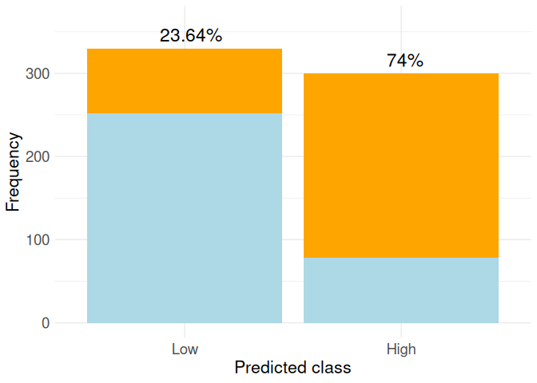

``` r
#ggsave("Simulated_2x2.png", plot = graph_bar_plot_results_binary, width = 6, height = 4, dpi = 300)
```

## 2 cuts: 1/3-2/3

``` r
ths = c(1/3,2/3)
GPS_p_values = c('p_11','p13','r1_1','r31')
results_tri <- Case_FixedThreshold(df, probs_model_train_class1, ths, GPS_p_values)
print(results_tri)
```

    $GPS
    [1] 0.6946692

    $CM
                   Class_observed
    Class_predicted   0   1
                  0 208  32
                  1  81  99
                  2  41 169

``` r
list_names_obs <- c('Low','High')
list_names_pred <- c('Low','Medium','High')
graph_bar_plot_tri <- barplot_CM(results_tri$CM,list_names_obs,list_names_pred)
graph_bar_plot_tri
```

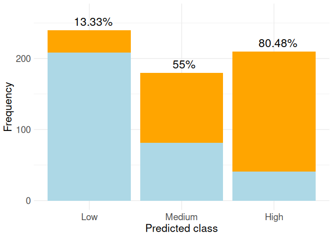

``` r
#ggsave("Simulated_3x2.png", plot = graph_bar_plot_tri, width = 6, height = 4, dpi = 300)
```

## Plot SVM hyperplanes 2x2 and 3x2 with fixed thresholds

``` r
coefs_svm = coef(model_svm)

va1=bisect(to_optim(1/3, model_svm$probA, model_svm$probB), -2,2)
va1$root #valor que tenemos que utilizar para dibujar el hiperplano
```

    [1] -0.6571624

``` r
va2=bisect(to_optim(2/3, model_svm$probA, model_svm$probB), -3,3)
va2$root #valor que tenemos que utilizar para dibujar el hiperplano
```

    [1] 0.4974941

``` r
df$class <- as.factor(df$class)

graph_2_3 <- df %>% ggplot(aes(x = x1, y = x2, colour = class)) + geom_point(aes(shape = class), linewidth = 3,show.legend = FALSE) +
  geom_abline(aes(intercept = (-coefs_svm[1])/coefs_svm[3], slope = -coefs_svm[2]/coefs_svm[3], colour="black", linetype = "dashed"), size=0.7, show.legend = FALSE) +
  geom_abline(aes(intercept = (-coefs_svm[1]+va1$root)/coefs_svm[3], slope = -coefs_svm[2]/coefs_svm[3], colour="black", linetype = "solid"), size=0.7, show.legend = FALSE) +
  geom_abline(aes(intercept = (-coefs_svm[1]+va2$root)/coefs_svm[3], slope = -coefs_svm[2]/coefs_svm[3], colour="black", linetype = "solid"), size=0.7, show.legend = FALSE) +
  scale_color_manual(values=c("lightblue","orange","black", "black")) +
  theme_minimal() +
  xlab("")+ylab("")

#ggsave("graph_svm_2_3.png", plot = graph_2_3, width = 10, height = 6, dpi = 300)
```

# Max GPS without constraints

## Max GPS(p_11,p13,r1_1,r31)

``` r
restriction = FALSE
num_cuts = 2
vector_GPS = c('p_11','p13','r1_1','r31')
user_condition <- NULL
results_2cuts_MaxGPS_class <- AfterTheModel(df, probs_model_train,restriction,user_condition,vector_GPS,num_cuts)
print(results_2cuts_MaxGPS_class)
```

    $GPS
    [1] 0.7622974

    $thresholds
    [1] 0.40 0.45

    $best_CM
                   Class_observed
    Class_predicted   0   1
                  0 229  44
                  1  12  15
                  2  89 241

``` r
list_names_obs <- c('Low','High')
list_names_pred <- c('Low','Medium','High')
graph_bar_plot_2cuts_MaxGPS_class <- barplot_CM(results_2cuts_MaxGPS_class$best_CM,list_names_obs,list_names_pred)
graph_bar_plot_2cuts_MaxGPS_class
```

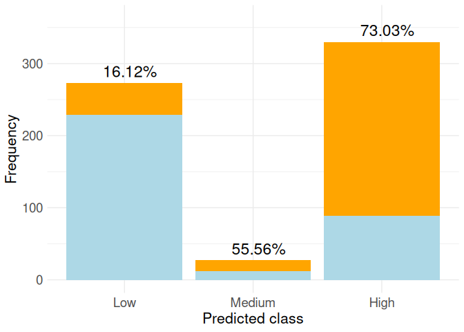

``` r
#ggsave("Simulated_MaxGPS_class_NoRestrictions.png", plot = graph_bar_plot_2cuts_MaxGPS_class, width = 6, height = 4, dpi = 300)
```

## Max GPS(p13, p_11, r31)

``` r
restriction = FALSE
num_cuts = 2
vector_GPS = c('p13', 'p_11', 'r31')
user_condition <- NULL
results_2cuts_MaxGPS <- AfterTheModel(df, probs_model_train,restriction,user_condition,vector_GPS,num_cuts)
print(results_2cuts_MaxGPS)
```

    $GPS
    [1] 0.8353992

    $thresholds
    [1] 0.1 0.4

    $best_CM
                   Class_observed
    Class_predicted   0   1
                  0  81   2
                  1 148  42
                  2 101 256

``` r
list_names_obs <- c('Low','High')
list_names_pred <- c('Low','Medium','High')
graph_bar_plot_2cuts_MaxGPS <- barplot_CM(results_2cuts_MaxGPS$best_CM,list_names_obs,list_names_pred)
graph_bar_plot_2cuts_MaxGPS
```

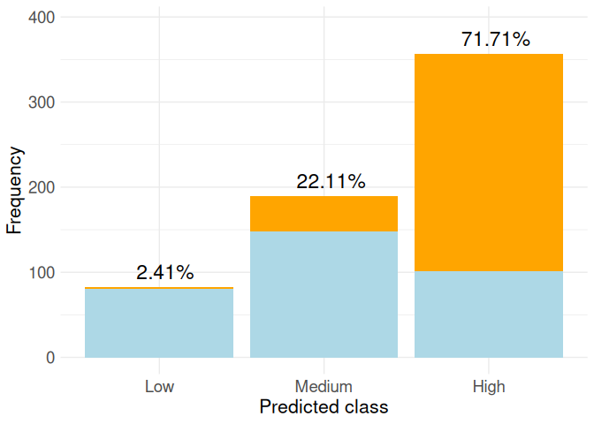

``` r
#ggsave("Simulated_MaxGPS_NoRestrictions.png", plot = graph_bar_plot_2cuts_MaxGPS, width = 6, height = 4, dpi = 300)
```

# Max GPS with restrictions

``` r
restriction = TRUE
user_condition <- function(p, p_, r, r_) {
  (p[3] > 0.8) & (p_[1] > 0.9) & (r_[1]>0.4) 
}

num_cuts = 2
vector_GPS = c('p13', 'p_11','r31' ) #'r1_1',
results_restric1 <- AfterTheModel(df, probs_model_train,restriction,user_condition,vector_GPS,num_cuts)
results_restric1
```

    $GPS
    [1] 0.7477466

    $thresholds
    [1] 0.20 0.65

    $best_CM
                   Class_observed
    Class_predicted   0   1
                  0 151  12
                  1 135 110
                  2  44 178

``` r
list_names_obs <- c('Low','High')
list_names_pred <- c('Low','Medium','High')
graph_restric1 <- barplot_CM(results_restric1$best_CM,list_names_obs,list_names_pred)
graph_restric1
```

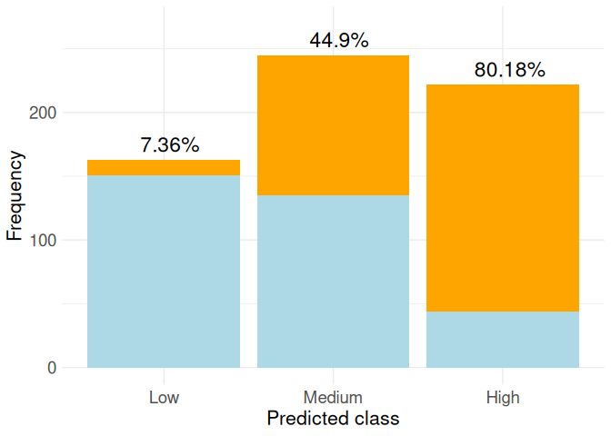

``` r
#ggsave("Simulated_MaxGPS_Restrictions1.png", plot = graph_restric1, width = 6, height = 4, dpi = 300)
```

# In the model

``` r
user_condition <- function(p, p_, r, r_) {
  # Constraints list
  conditions <- list(
    list(value = p_[1], threshold = 0.9, op = ">"),  
     list(value = r_[1], threshold = 0.4, op = ">"),   
    list(value = p[3], threshold = 0.8, op = ">")    
  )
  
  # Evaluation of constraints
  results <- lapply(conditions, function(cond) {
    if (cond$op == "<") return(cond$value < cond$threshold)
    if (cond$op == ">") return(cond$value > cond$threshold)
    if (cond$op == "<=") return(cond$value <= cond$threshold)
    if (cond$op == ">=") return(cond$value >= cond$threshold)
  })
  
  all_true = all(unlist(results))
  if (all_true){
    total_cond = TRUE
  } else{
    total_cond = FALSE
  }
  
  return(list(conditions = conditions, results = results,total_cond=total_cond))
}
```

``` r
kernelSVM = 'linear'
num_cuts = 2
vector_GPS = c('p13', 'p_11', 'r31')
cv_folds = 3
restriction = TRUE

results_In <- InTheModel(df,kernelSVM,num_cuts,cv_folds,vector_GPS,restriction,user_condition)
results_In
```

    $thresholds
    [1] 0.20 0.65

    $GPS_train
    [1] 0.7386935

    $GPS_test
    [1] 0.7445375

    $error
    [1] 0

    $best_CM_test
                   Class_observed
    Class_predicted  0  1
                  0 47  3
                  1 49 39
                  2 14 58

    $best_param_model
    [1] 0.1

    $best_model_trained

    Call:
    svm(formula = class ~ ., data = training_fold, kernel = kernelSVM, 
        cost = C_i, probability = TRUE, scale = FALSE)


    Parameters:
       SVM-Type:  C-classification 
     SVM-Kernel:  linear 
           cost:  0.1 

    Number of Support Vectors:  258

``` r
model_in <- results_In$best_model_trained
probs_test_in <- predict(model_in,df_no_target, probability=TRUE, decision.values = TRUE)

probs_model_train_in <- attr(probs_test_in,"probabilities")
probs_model_train_in <- probs_model_train_in[,c("0", "1")]
probs_model_train_class1_in <- probs_model_train_in[,2]
```

``` r
ths_in = results_In$thresholds
breaks <- c(Inf, ths_in, -Inf)
Y_pred_class <- cut(probs_model_train_class1_in, breaks = breaks, labels = 0:length(ths_in), right = FALSE)
unique_values <- unique(Y_pred_class) 
Y_pred_class <- factor(Y_pred_class, levels = sort(unique_values))
CM <- table(Class_predicted = Y_pred_class,Class_observed = df$class)
CM
```

                   Class_observed
    Class_predicted   0   1
                  0 145   9
                  1 145 120
                  2  40 171

``` r
vector_GPS = c('p13', 'p_11', 'r31')
GPS_from_CM(CM,vector_GPS)
```

    [1] 0.7406725

``` r
list_names_obs <- c('Low','High')
list_names_pred <- c('Low','Medium','High')
graph_in <- barplot_CM(CM,list_names_obs,list_names_pred)
graph_in
```

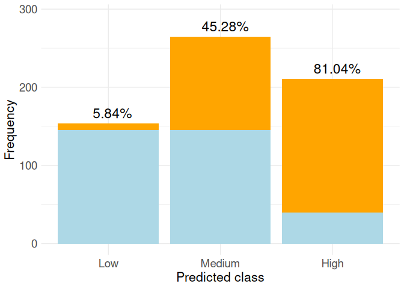

``` r
#ggsave("Simulated_InTheModel.png", plot = graph_in, width = 6, height = 4, dpi = 300)
```

# Plot SVM in-the-model vs after-the-model

``` r
# After-the-model
ths_after = results_restric1$thresholds
va1_a=bisect(to_optim(ths_after[1], model_svm$probA, model_svm$probB), -2,2)
va1_a$root 
```

    [1] -1.234491

``` r
va2_a=bisect(to_optim(ths_after[2], model_svm$probA, model_svm$probB), -3,3)
va2_a$root 
```

    [1] 0.435769

``` r
# In-the-model
model_in
```


    Call:
    svm(formula = class ~ ., data = training_fold, kernel = kernelSVM, 
        cost = C_i, probability = TRUE, scale = FALSE)


    Parameters:
       SVM-Type:  C-classification 
     SVM-Kernel:  linear 
           cost:  0.1 

    Number of Support Vectors:  258

``` r
ths_in 
```

    [1] 0.20 0.65

``` r
coef_svm_in = coef(model_in)


va1_b=bisect(to_optim(ths_in[1], model_in$probA, model_in$probB), -10,10)
va1_b$root 
```

    [1] -1.092939

``` r
va2_b=bisect(to_optim(ths_in[2], model_in$probA, model_in$probB), -10,10)
va2_b$root 
```

    [1] 0.389971

``` r
# Graph
graph_after_in = df %>% ggplot(aes(x = x1, y = x2, colour = class)) + geom_point(aes(shape = class), size = 3,show.legend = FALSE) +
  geom_abline(aes(intercept = (-coef_svm_in[1]+va1_b$root)/coef_svm_in[3], 
                  slope = -coef_svm_in[2]/coef_svm_in[3], colour="black", linetype = "dashed"), size=0.7, show.legend = FALSE) +
  geom_abline(aes(intercept = (-coef_svm_in[1]+va2_b$root)/coef_svm_in[3], 
                  slope = -coef_svm_in[2]/coef_svm_in[3], colour="black", linetype = "dashed"), size=0.7, show.legend = FALSE) +
  geom_abline(aes(intercept = (-coefs_svm[1]+va1_a$root)/coefs_svm[3],
                  slope = -coefs_svm[2]/coefs_svm[3], colour="black", linetype = "solid"), size=0.7, show.legend = FALSE) +
  geom_abline(aes(intercept = (-coefs_svm[1]+va2_a$root)/coefs_svm[3], 
                  slope = -coefs_svm[2]/coefs_svm[3], colour="black", linetype = "solid"), size=0.7, show.legend = FALSE) +
  scale_color_manual( values=c("lightblue","orange","black", "black")) + theme_minimal() +
  xlab("")+ylab("") 
#ggsave("graph_svm_after_in.png", plot = graph_after_in, width = 10, height = 6, dpi = 300)
```

# Calibration: isotonic

``` r
class_train <- df$class
class_test <- df$class

probs_train <- probs_model_train
probs_test <- probs_model_train

class_prin <- 2
calibration_model <- calibrate(class_train, probs_train[,class_prin], class1=class_prin, 
                               method="isoReg",assumeProbabilities=TRUE)

# apply the calibration to the testing set
calibratedProbs <- applyCalibration(probs_test[,class_prin], calibration_model)

ths = c(1/3,2/3)
GPS_p_values = c('p_11','p13','r1_1','r31')
results_iso <- Case_FixedThreshold(df, calibratedProbs, ths, GPS_p_values)
results_iso
```

    $GPS
    [1] 0.7108888

    $CM
                   Class_observed
    Class_predicted   0   1
                  0 201  26
                  1  82  87
                  2  47 187

``` r
list_names_obs <- c('Low','High')
list_names_pred <- c('Low','Medium','High')
graph_bar_plot_iso <- barplot_CM(results_iso$CM,list_names_obs,list_names_pred)
graph_bar_plot_iso
```

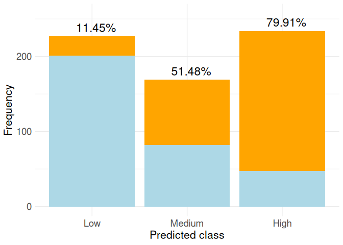

``` r
#ggsave("Simulated_MaxGPS_IsoReg.png", plot = graph_bar_plot_iso, width = 6, height = 4, dpi = 300)
```

# 2x2 with ROC, calibration and proposed methods

Best threshold according to ROC

``` r
library(pROC)
roc_obj <- roc(df$class, probs_model_train_class1)

# Youden
youden_thresh <- coords(roc_obj, "best", best.method = "youden")

# closest.topleft
topleft_thresh <- coords(roc_obj, "best", best.method = "closest.topleft")

print(youden_thresh)
```

      threshold specificity sensitivity
    1 0.4184991   0.7212121   0.8366667

``` r
print(topleft_thresh)
```

      threshold specificity sensitivity
    1 0.4184991   0.7212121   0.8366667

``` r
breaks_roc <- c(Inf, topleft_thresh$threshold, -Inf)
Y_pred_class <- cut(probs_model_train_class1, breaks = breaks_roc, labels = 0:length(topleft_thresh$threshold), right = FALSE)
unique_values <- unique(Y_pred_class) 
Y_pred_class <- factor(Y_pred_class, levels = sort(unique_values))
CM <- table(Class_predicted = Y_pred_class,Class_observed = df$class)
CM
```

                   Class_observed
    Class_predicted   0   1
                  0 238  49
                  1  92 251

``` r
vector_GPS = c('p12', 'p_11', 'r21','r1_1')
GPS_from_CM(CM,vector_GPS)
```

    [1] 0.7760676

``` r
list_names_obs <- c('Low','High')
list_names_pred <- c('Low','High')
graph_roc <- barplot_CM(CM,list_names_obs,list_names_pred)
graph_roc
```

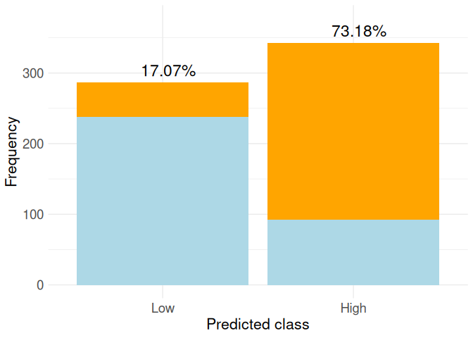

``` r
#ggsave("Simulated_roc.png", plot = graph_roc, width = 6, height = 4, dpi = 300)
```

With isotonic regression

``` r
class_train <- df$class
class_test <- df$class

probs_train <- probs_model_train
probs_test <- probs_model_train

class_prin <- 2
calibration_model <- calibrate(class_train, probs_train[,class_prin], class1=class_prin, 
                               method="isoReg",assumeProbabilities=TRUE)

# apply the calibration to the testing set
calibratedProbs <- applyCalibration(probs_test[,class_prin], calibration_model)

ths = c(1/2)
GPS_p_values = c('p_11','p12','r1_1','r21')
results_iso2 <- Case_FixedThreshold(df, calibratedProbs, ths, GPS_p_values)
results_iso2
```

    $GPS
    [1] 0.7760676

    $CM
                   Class_observed
    Class_predicted   0   1
                  0 238  49
                  1  92 251

``` r
list_names_obs <- c('Low','High')
list_names_pred <- c('Low','High')
graph_bar_plot_iso2 <- barplot_CM(results_iso2$CM,list_names_obs,list_names_pred)
graph_bar_plot_iso2
```


``` r
#ggsave("Simulated_2x2_IsoReg.png", plot = graph_bar_plot_iso2, width = 6, height = 4, dpi = 300)
```

Max GPS(p_11,p12,r1_1,r21) without constraints

``` r
restriction = FALSE
num_cuts = 1
vector_GPS = c('p_11','p12','r1_1','r21')
user_condition <- NULL
step_th=0.0001
results_1cuts_MaxGPS_class <- AfterTheModel(df, probs_model_train,restriction,user_condition,vector_GPS,num_cuts,step_th)
print(results_1cuts_MaxGPS_class)
```

    $GPS
    [1] 0.7692908

    $thresholds
    [1] 0.4

    $best_CM
                   Class_observed
    Class_predicted   0   1
                  0 229  44
                  1 101 256

``` r
list_names_obs <- c('Low','High')
list_names_pred <- c('Low','High')
graph_bar_plot_1cuts_MaxGPS_class <- barplot_CM(results_1cuts_MaxGPS_class$best_CM,list_names_obs,list_names_pred)
graph_bar_plot_1cuts_MaxGPS_class
```

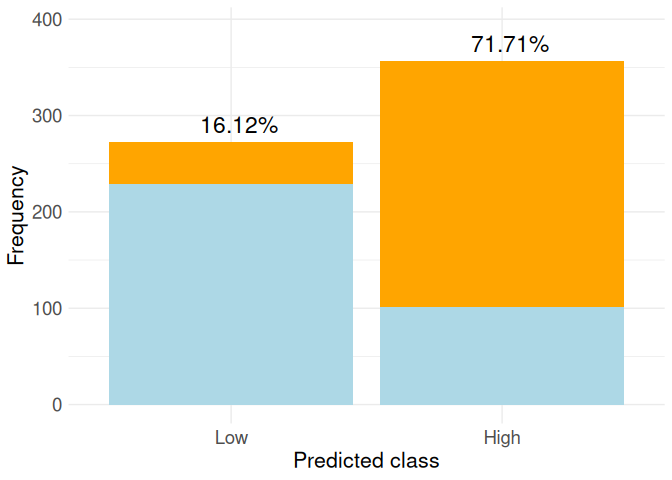

``` r
#ggsave("Simulated_MaxGPS_1cut_class_NoRestrictions.png", plot = graph_bar_plot_1cuts_MaxGPS_class, width = 6, height = 4, dpi = 300)
```

Max GPS with restrictions:

``` r
restriction = TRUE
user_condition <- function(p, p_, r, r_) {
  (p_[1] > 0.85)
}

num_cuts = 1
vector_GPS = c('p12', 'p_11', 'r21','r1_1')
results_restric1_2x2 <- AfterTheModel(df, probs_model_train,restriction,user_condition,vector_GPS,num_cuts)
results_restric1_2x2
```

    $GPS
    [1] 0.7550225

    $thresholds
    [1] 0.35

    $best_CM
                   Class_observed
    Class_predicted   0   1
                  0 213  36
                  1 117 264

``` r
list_names_obs <- c('Low','High')
list_names_pred <- c('Low','High')
graph_restric1_2x2 <- barplot_CM(results_restric1_2x2$best_CM,list_names_obs,list_names_pred)
graph_restric1_2x2
```

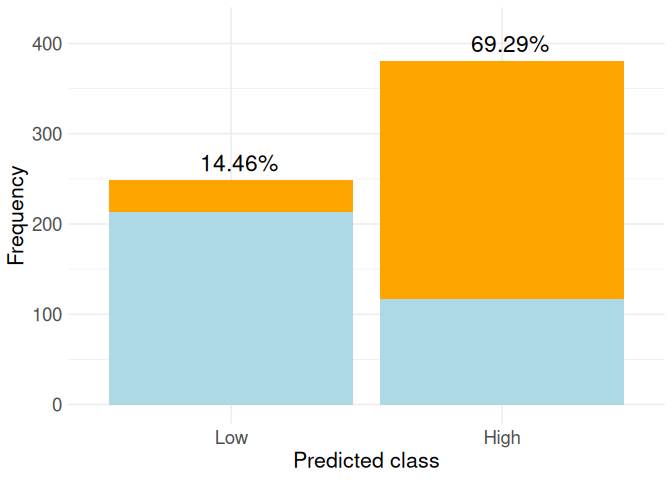

``` r
#ggsave("Simulated_MaxGPS_Restrictions1_2x2.png", plot = graph_restric1_2x2, width = 6, height = 4, dpi = 300)
```

In the model

``` r
user_condition <- function(p, p_, r, r_) {
  conditions <- list(
    list(value = p_[1], threshold = 0.85, op = ">")
  )
  
  results <- lapply(conditions, function(cond) {
    if (cond$op == "<") return(cond$value < cond$threshold)
    if (cond$op == ">") return(cond$value > cond$threshold)
    if (cond$op == "<=") return(cond$value <= cond$threshold)
    if (cond$op == ">=") return(cond$value >= cond$threshold)
  })
  
  all_true = all(unlist(results))
  if (all_true){
    total_cond = TRUE
  } else{
    total_cond = FALSE
  }
  
  return(list(conditions = conditions, results = results,total_cond=total_cond))
}
```

``` r
kernelSVM = 'linear'
num_cuts = 1
vector_GPS = c('p12', 'p_11', 'r21','r1_1')
cv_folds = 3
restriction = TRUE

results_In <- InTheModel(df,kernelSVM,num_cuts,cv_folds,vector_GPS,restriction,user_condition)
results_In
```

    $thresholds
    [1] 0.35

    $GPS_train
    [1] 0.7621243

    $GPS_test
    [1] 0.8134076

    $error
    [1] 0

    $best_CM_test
                   Class_observed
    Class_predicted  0  1
                  0 79  8
                  1 31 92

    $best_param_model
    [1] 0.01

    $best_model_trained

    Call:
    svm(formula = class ~ ., data = training_fold, kernel = kernelSVM, 
        cost = C_i, probability = TRUE, scale = FALSE)


    Parameters:
       SVM-Type:  C-classification 
     SVM-Kernel:  linear 
           cost:  0.01 

    Number of Support Vectors:  337

``` r
model_in <- results_In$best_model_trained
probs_test_in <- predict(model_in,df_no_target, probability=TRUE, decision.values = TRUE)

probs_model_train_in <- attr(probs_test_in,"probabilities")
probs_model_train_in <- probs_model_train_in[,c("0", "1")]
probs_model_train_class1_in <- probs_model_train_in[,2]
```

``` r
ths_in = results_In$thresholds
breaks <- c(Inf, ths_in, -Inf)
Y_pred_class <- cut(probs_model_train_class1_in, breaks = breaks, labels = 0:length(ths_in), right = FALSE)
unique_values <- unique(Y_pred_class) 
Y_pred_class <- factor(Y_pred_class, levels = sort(unique_values))
CM <- table(Class_predicted = Y_pred_class,Class_observed = df$class)
CM
```

                   Class_observed
    Class_predicted   0   1
                  0 222  30
                  1 108 270

``` r
vector_GPS = c('p12', 'p_11', 'r21','r1_1')
GPS_from_CM(CM,vector_GPS)
```

    [1] 0.779312

``` r
list_names_obs <- c('Low','High')
list_names_pred <- c('Low','High')
graph_in2 <- barplot_CM(CM,list_names_obs,list_names_pred)
graph_in2
```

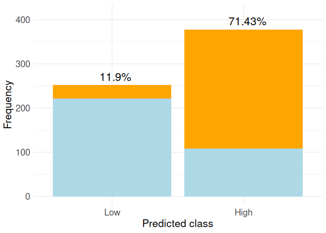

``` r
#ggsave("Simulated_InTheModel_2x2.png", plot = graph_in2, width = 6, height = 4, dpi = 300)
```
